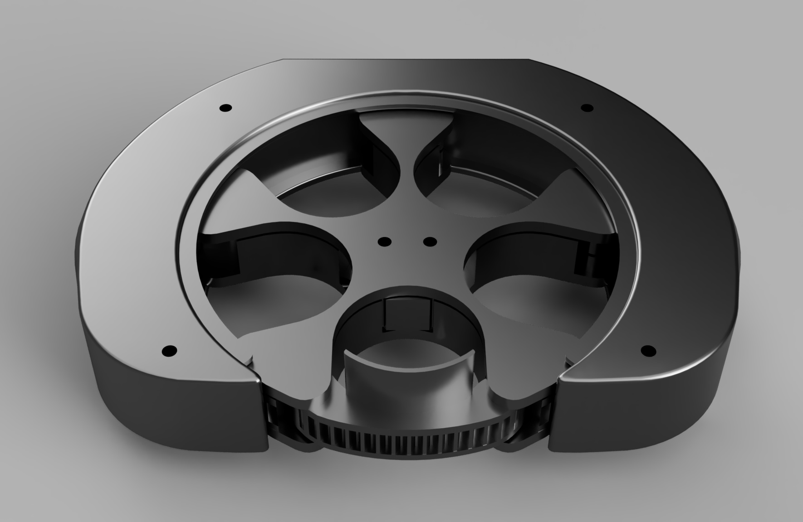
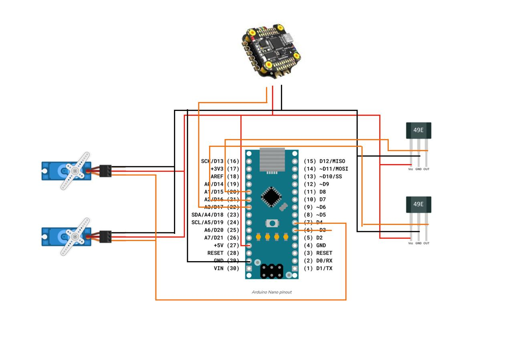
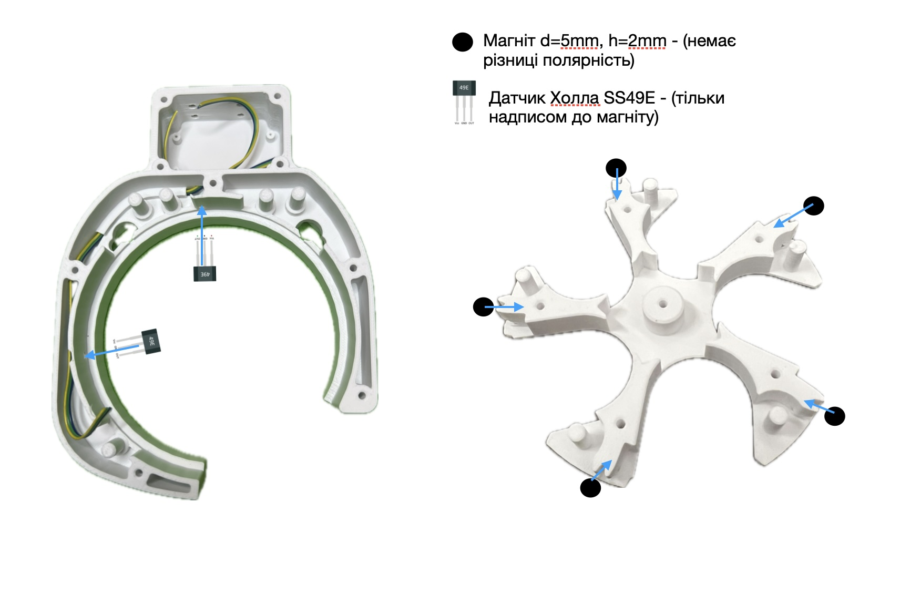

# Барабанний Скид для FPV

## Огляд

Цей проект є барабанним скидом для FPV, розробленим для скидання 5 предметів. Він може бути монтований на дрон і управляється за допомогою сервопривода. Сам скид складається з двох основних частин: корпусу та барабану. Корпус закріплюється на дроні, тоді як барабан обертається всередині корпусу. В барабані є отвори, через які можуть випадати предмети. Сервопривід забезпечує обертання барабана та відкривання/закривання отворів.

## Інструкції зі збірки

### Налаштування друку

- Підтримка: Відсутня
- Стінки: 4 шари
- Заповнення: 20%
- Верхні/нижні стінки: 4 шари
- Матеріал: PETG

### Матеріали

- (1) БРФ_1.01.005.010_Корпус с Ардуино на 2 Холла
- (1) БРФ_1,01,005,016_Ревизия плоская
- (1) БРФ_1,01,005,013_Корпус барабана_магнит 5х2
- (2) БРФ_1,01,005,006_Шестерня привода (x,x)
- (5) БРФ_1.01.005.003_Заслонка_5stk
- (1) БРФ_1.01.005.002_Централь
- (1) БРФ_1.01.005.004_Крышка барабана
- (5) БРФ_1.01.005.005_Толкатель_5stk
- (5) БРФ_1.01.005.007_Шестерня ведомая_5stk
- (1) БРФ_1.01.005.012_Крышка под ардуино
- (4) Винти М3×20 для затискання корпусу
- (7) Винти M3x8 (DIN 965 (хрест) або DIN 7991 (шестиграник)) - 7 штук
- (6) Винти M3x8 (DIN 965 (хрест) або DIN 7991 (шестиграник)) - 6 штук

### Електроніка

- (2) Сервоприводи MG-90 360 (без стопера)
- (5) Пружини d=5mm
- (2) Датчик Холла SS49E
- (1) Arduino Nano
- (2) Шлейф 3-жильний 26AWG 1м (Чорний, Червоний, Жовтий)
- (1) Коннектор 40 пин папа
- (5) коннекторов DUPONT 2.54 mm
- (5) Магнит d=5mm, h=2mm

### Необхідні інструменти та матеріали

- Викрутка (хрестова або плоска, залежно від кріплення корпусу серво)
- Паяльник і припій
- Електроізоляційна стрічка або термоусаджувальна трубка
- Сервотестер
- Блок живлення на 5 вольт

## Інструкції з прошивки

Цей документ містить інструкції з прошивки для Arduino Nano. Перед початком переконайтесь, що у вас встановлене середовище розробки, яке підтримує вашу Arduino Nano.

### Загальні вимоги

- Встановлене середовище [Arduino IDE](https://www.arduino.cc/en/software) або [PlatformIO](https://platformio.org/platformio-ide) для Arduino.
- USB-кабель для підключення плати до комп'ютера.
- Драйвери для вашої плати, якщо вони потрібні.

### Прошивка для Arduino

1. Відкрийте Arduino IDE.
2. Виберіть `Файл` > `Відкрити...` та знайдіть файл `firmware.ino` у папці `arduino`.
3. Підключіть вашу п

лату Arduino до комп'ютера через USB.
4. Виберіть тип плати та порт у `Інструменти`.
5. Натисніть `Завантажити` для прошивки плати.

## Схема підключення до Arduino

## Схема підключення датчиків положення

## Примітки

- Переконайтесь, що вибраний правильний COM-порт для вашої плати перед завантаженням.
- У деяких випадках може бути потрібно натиснути та утримувати кнопку BOOT на платі перед завантаженням або скинути плату безпосередньо після початку завантаження.

Якщо у вас виникають проблеми з підключенням або прошивкою, зверніться до офіційної документації вашої платформи.
